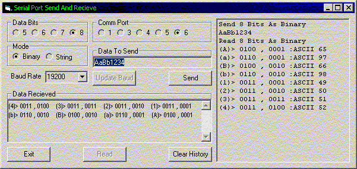



## CommPortSendRecv

### Description

The reason I wrote this app was to allow me to communicate with a PLC via a serial port. It allowed me to send data t the device and then read the response from the device basically to ensure that I was sending the right data and that I was getting the correct response from the device.
 
### More Info
 

             |
---                |---
**Submitted On**   |2002-02-14 19:37:38
**By**             |[Tom DeWitt](https://github.com/Planet-Source-Code/PSCIndex/blob/master/ByAuthor/tom-dewitt.md)
**Level**          |Intermediate
**User Rating**    |4.9 (93 globes from 19 users)
**Compatibility**  |VB 6\.0
**Category**       |[Complete Applications](https://github.com/Planet-Source-Code/PSCIndex/blob/master/ByCategory/complete-applications__1-27.md)
**World**          |[Visual Basic](https://github.com/Planet-Source-Code/PSCIndex/blob/master/ByWorld/visual-basic.md)
**Archive File**   |[CommPortSe553642152002\.zip](https://github.com/Planet-Source-Code/tom-dewitt-commportsendrecv__1-31818/archive/master.zip)

